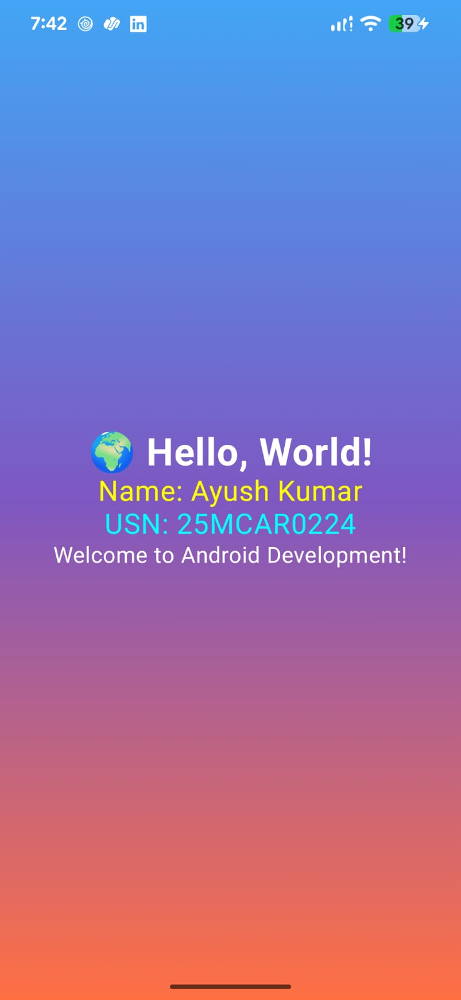

# Hello World Android Application

## Student Details

- **Name:** Ayush Kumar
- **USN:** 25MCAR0224

---

# Experiment Title

**Developing a Simple Android Application using Kotlin and Jetpack Compose**

---

# Objective

The objective of this experiment is to develop a simple Android application using Android Studio and Kotlin. The application demonstrates the use of Jetpack Compose for building modern Android user interfaces and displays a motivational quote on a colorful gradient background.

---

# Concept / Technology Used

## Android Studio

Android Studio is the official Integrated Development Environment (IDE) for Android application development. It provides tools for coding, debugging, testing, and deploying Android applications.

## Kotlin

Kotlin is Google's recommended programming language for Android development. It is concise, modern, null-safe, and fully interoperable with Java.

## Jetpack Compose

Jetpack Compose is Android's modern UI toolkit used to build native user interfaces entirely in Kotlin without requiring XML layouts. It simplifies UI development through reusable composable functions.

---

# Scenario

The application displays the motivational quote:

> **"When life gives you lemons, make lemonade and enjoy!"**

The quote is displayed on a colorful gradient background to demonstrate:

- Building an Android application using Kotlin
- Creating UI with Jetpack Compose
- Displaying text using the `Text` composable
- Applying a colorful gradient background
- Running the application on an Android device

---

# Project Folder Structure

```text
HelloWorld/
│
├── app/
│   ├── screenshots/
│   │   ├── output.png
│   │   ├── test1.png
│   │   ├── test2.png
│   │   └── test3.png
│   │
│   ├── src/
│   │   ├── androidTest/
│   │   ├── main/
│   │   │   ├── java/
│   │   │   │   └── com/
│   │   │   │       └── example/
│   │   │   │           └── helloworld/
│   │   │   │               └── MainActivity.kt
│   │   │   │
│   │   │   ├── res/
│   │   │   └── AndroidManifest.xml
│   │   │
│   │   └── test/
│   │
│   ├── build.gradle.kts
│   └── proguard-rules.pro
│
├── gradle/
├── build.gradle.kts
├── settings.gradle.kts
├── gradle.properties
├── .gitignore
└── README.md
```

---

# Application Output

The following screenshot shows the successful execution of the Android application.


---

# Test Cases

## Test Case 1

### Test Description

Verify that the application launches successfully.

### Input

Open the application.

### Expected Output

The application starts without any errors and displays the Hello World on a colorful gradient background.

### Actual Output

The application launched successfully.

### Result

**PASS**

### Screenshot


---

## Test Case 2

### Test Description

Verify that the motivational quote is displayed correctly.

### Input

Run the application.

### Expected Output

The following quote should be displayed:

> "When life gives you lemons, make lemonade and enjoy!"

### Actual Output

The quote is displayed correctly on the screen.

### Result

**PASS**

### Screenshot


---

## Test Case 3 (Student Details)

### Test Description

Verify that the application correctly displays the student's details.

### Input

Temporarily modify the application to display:

- **Name:** Ayush Kumar
- **USN:** 25MCAR0224

### Expected Output

The student's Name and USN are displayed correctly.

### Actual Output

The Name and USN are displayed correctly.

### Result

**PASS**

### Screenshot



---

# Conclusion

This experiment successfully demonstrated the development of a simple Android application using Android Studio, Kotlin, and Jetpack Compose.

The project showcased:

- Creating an Android project in Android Studio
- Building a user interface using Jetpack Compose
- Displaying text using composable functions
- Applying a colorful gradient background
- Running and testing the application on an Android device
- Performing basic application testing and documenting the results

The experiment provided practical experience with modern Android application development and GitHub project documentation.

---

# Author

**Ayush Kumar**

**USN:** 25MCAR0224
